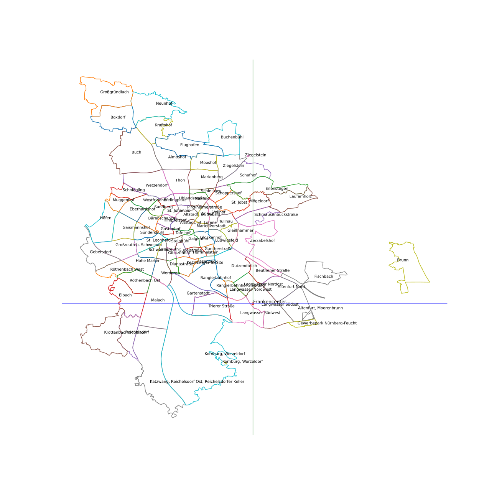

# Nürnberg Umrisse Stadtteile

Plotten der Umrisse von Nürnberg und der Stadtteile basierend auf Shapefile ([Quelle](https://wiki.openstreetmap.org/wiki/N%C3%BCrnberg/Stadtteile)).
Inkl. Umrechnung von GPS-Koordinaten in Koordinatenangaben im Shapefile.

Das [Jupyter-Notebook](Nürnberg-Shape-Files.ipynb) sollte zum großen Teil selbsterklärend sein, bei Fragen gerne ein Issue aufmachen.

Beispiel:

